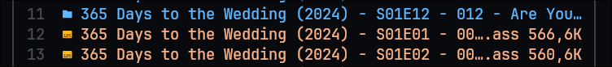
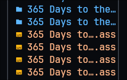
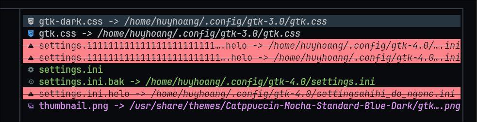
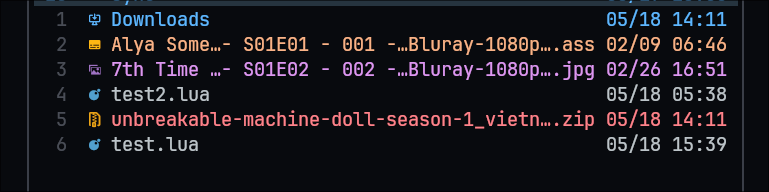
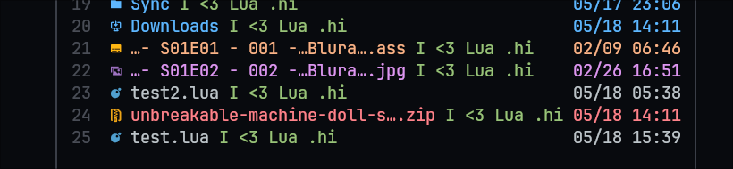
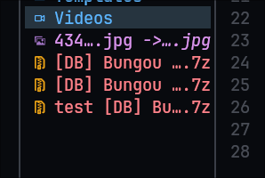

# smart-truncate.yazi (deprecated)

DEPRECATED: In favor of yazi official truncate method. I will still fix this plugin to compatible with future updates of yazi, but won't fix any issue.

A [Yazi](https://github.com/sxyazi/yazi) plugin to truncate any component when rendering using Entity.

## Requirements

- [Yazi](https://github.com/sxyazi/yazi) >= v25.5.31

## Previews

- Current/Middle pane:

  

- Parent pane:

  

- Preview pane:



- Using `always_show_patterns = { "%- S%d%dE%d%d %- %d+ %-", " ?Bluray%-%d+p", " ?WEBDL%-%d+p" }`:

  

## Installation

```sh
ya pkg add boydaihungst/smart-truncate
# or
ya pack -a boydaihungst/smart-truncate
```

## Configuration

### Previewer pane (Right) (Optional)

If you want to use this as a previewer, add this to your `yazi.toml`:
This will replace `folder` previewer with `smart-truncate` previewer.
More info: https://yazi-rs.github.io/docs/plugins/overview#previewer

> [!IMPORTANT]
>
> For yazi nightly replace `name` with `url`

```toml
  prepend_previewers = [
    { name = "*/", run = "smart-truncate" },
  ]

  # Or if you prefer to override the default previewer
  previewers = [
    { name = "*/", run = "smart-truncate" },
  ]
```

### Current (Middle) and Parent (Left) pane (Optional)

If you want to use this in current pane, add this to your `init.lua`:

```lua
local smart_truncate = require("smart-truncate")
smart_truncate:setup({
	-- Set to false to disable rendering in parent/left panel
	render_parent = true, -- default false

	-- Set to false to disable rendering in current/middle panel
	render_current = true, -- default false

	-- Default only name and symlink will be truncated if overflow. 4 -> highlights/name, 6 -> symlink
	-- IDs can be found in https://github.com/sxyazi/yazi/blob/main/yazi-plugin/preset/components/entity.lua#L4-L9
	-- resizable_entity_children_ids = { 4, 6 }, -- default { 4, 6 }

	-- A list of lua patterns which will always show when file is truncated, unless the space is not enough
	-- Learn more about lua patterns: https://www.lua.org/pil/20.2.html or ask AI for help
	always_show_patterns = { "%- S%d%dE%d%d %- %d+ %-", " ?Bluray%-%d+p", " ?WEBDL%-%d+p", smart_truncate:is_literal_string("this is literal string") }, -- default nil, Optional
})
```

### Advanced Usage

#### For custom components

You can add custom components to list of resizable components following this example:



Add this after `smart_truncate:setup(...)` function:

- There are two ways to add a component to entity

  ```lua
  -- A sample text which will overflow any tabs above
  local function sample_get_text()
    local sample_suffix = ".hi"
    local sample_text_before_shorten = " I <3 Lua " .. sample_suffix
    return sample_text_before_shorten
  end
  ```

  1. Using component function name, like this official (Entity.\_children list)[https://github.com/sxyazi/yazi/blob/main/yazi-plugin/preset/components/entity.lua#L4-L9]:
     By default, highlights/name and symlink are already added.

  ```lua
  function Entity:a_sample_component()
    -- NOTE: Do stuff to get original text (which could overflow the pane). For example, get file name, file size, etc.
    return ui.Span(sample_get_text())
  end

  -- Same name as component function name above: Entity:a_sample_component() -> a_sample_component
  Entity:children_add("a_sample_component", 7000)

  --  You can also use this to add official components like "spacer", "icon", "prefix", "found" as well.
  smart_truncate:children_add("a_sample_component", function(current_entity)
    -- NOTE: Do stuff to get original text (which could overflow the pane). For example, get file name, file size, etc.
    local text_before_shorten = sample_get_text()
    local sample_suffix = ".hi" -- (Optional) This will keep the suffix in the end of the text after shortening.
    -- For example, if you shorten "1234567890qwertyuiop.xyz" to "1234567890qwertyuiop…", then the suffix ".xyz" will be appended to the end of the shortened text -> "1234567890qwertyuiop….xyz"

    -- NOTE: Then shorten the text to fit the pane. Suffix is optional.
    local max_length = current_entity:get_component_max_length("a_sample_component") or 0
    -- This is optional, if you want to use always_show_patterns
    local always_show_patterns = { "%- S%d%dE%d%d %- %d+ %-", " ?Bluray%-%d+p", " ?WEBDL%-%d+p" }
    local text_after_shorten = smart_truncate:shorten(max_length, text_before_shorten, sample_suffix, always_show_patterns)

    -- NOTE: Do other stuff here. For example, custom ui.Line, ui.Span, ui.Text, etc.
    return ui.Span(text_after_shorten):fg("green")

  end)
  ```

  2. Using component id:

  ```lua
  local b_sample_conponent_id = Entity:children_add(function()
  	-- NOTE: Do stuff to get sample_text_before_shorten and render
  	return ui.Span(sample_get_text())
  end, 7000)

  smart_truncate:children_add(b_sample_conponent_id, function(current_entity)
    -- NOTE: Do stuff to get sample_text_before_shorten
    local text_before_shorten = sample_get_text()
    local sample_suffix = ".hi"
    local max_length = current_entity:get_component_max_length(b_sample_conponent_id) or 0
    -- This is optional, if you want to use always_show_patterns
    local always_show_patterns = { "%- S%d%dE%d%d %- %d+ %-", " ?Bluray%-%d+p", " ?WEBDL%-%d+p" }
    local shortened = smart_truncate:shorten(max_length, text_before_shorten, sample_suffix, always_show_patterns)

    -- NOTE: Do other stuff here. For example, custom ui.Line, ui.Span, ui.Text, etc.
    return ui.Span(shortened):fg("green")
  end)
  ```

###

> [!NOTE]
> To remove child component:

```lua
  -- Use this if you want to remove the component from the list of resizable components (allow the component to be rendered overflowing the pane)
  smart_truncate:children_remove(a_sample_conponent_id_or_function_name)`
  -- Use this if you want to get rid of the component completely
  Entity:children_remove(a_sample_component_id)

```

#### For custom plugins which replaced `Current.redraw`, `Parent.redraw` or any function which using `Entity:redraw`

You can use `smart_truncate_entity_plugin:smart_truncate_entity(entity, max_width)` function to shorten the text in the pane.
For example, this relative-motions (my fork) plugin:

Parent pane:


```lua
  -- Check if smart_truncate setup function is added in init.lua
  local smart_truncate_entity_plugin_ok, smart_truncate_entity_plugin = pcall(require, "smart-truncate")
	if smart_truncate_entity_plugin_ok then
		smart_truncate_entity_plugin_ok = smart_truncate_entity_plugin:is_setup_loaded()
	end

  	Parent.redraw = function(parent_self)
		if not parent_self._folder then
			return {}
		end

		local entities = {}
		local parent_tab_window_w = parent_self._area.w
		for _, f in ipairs(parent_self._folder.window) do
			local entity = Entity:new(f)
			if resizable_entity_children_ids then
				if smart_truncate_entity_plugin_ok then
					smart_truncate_entity_plugin:smart_truncate_entity(entity, parent_tab_window_w)
				else
					if not state.warned_smart_truncate_missing then
						state.warned_smart_truncate_missing = true
						warn(
							"smart-truncate plugin is not installed or setup function is not called, please install it to use smart truncate feature \nor set smart_truncate = false in setup function"
						)
						return
					end
				end
			end
			-- Fall back to default render behaviour
			-- https://github.com/sxyazi/yazi/blob/70e459a0111f55a3f1be3746baf64cbf68a68fce/yazi-plugin/preset/components/parent.lua#L23-L25
			-- For Current.redraw https://github.com/sxyazi/yazi/blob/70e459a0111f55a3f1be3746baf64cbf68a68fce/yazi-plugin/preset/components/current.lua#L40-L41
			if state.warned_smart_truncate_missing or not resizable_entity_children_ids then
					entities[#entities + 1] = entity:redraw():truncate {
						max = parent_self._area.w,
						ellipsis = entity:ellipsis(parent_self._area.w),
					}
			else
				-- Using smart truncate
				entities[#entities + 1] = ui.Line({ entity:redraw() }):style(entity:style())
			end
		end

		return {
			ui.List(entities):area(parent_self._area),
		}
	end
```

#### For relative-motions (my fork) plugin users:

Add this to your `init.lua`, everything should work out of the box:

```lua
  local smart_truncate = require("smart-truncate")
  smart_truncate:setup({})

  require("relative-motions"):setup({
    -- Require to use smart truncate:
	  smart_truncate = true,

    -- Optional:
	  show_numbers = "relative_absolute",
	  show_motion = true,
	  line_numbers_styles = {
		  hovered = {
			  fg = "#61afef",
		  },
		  normal = {
			  fg = "#494D56",
		  },
	  },
  })
```
